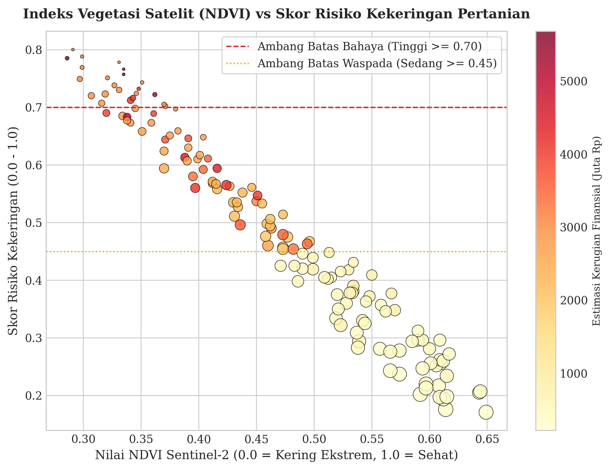
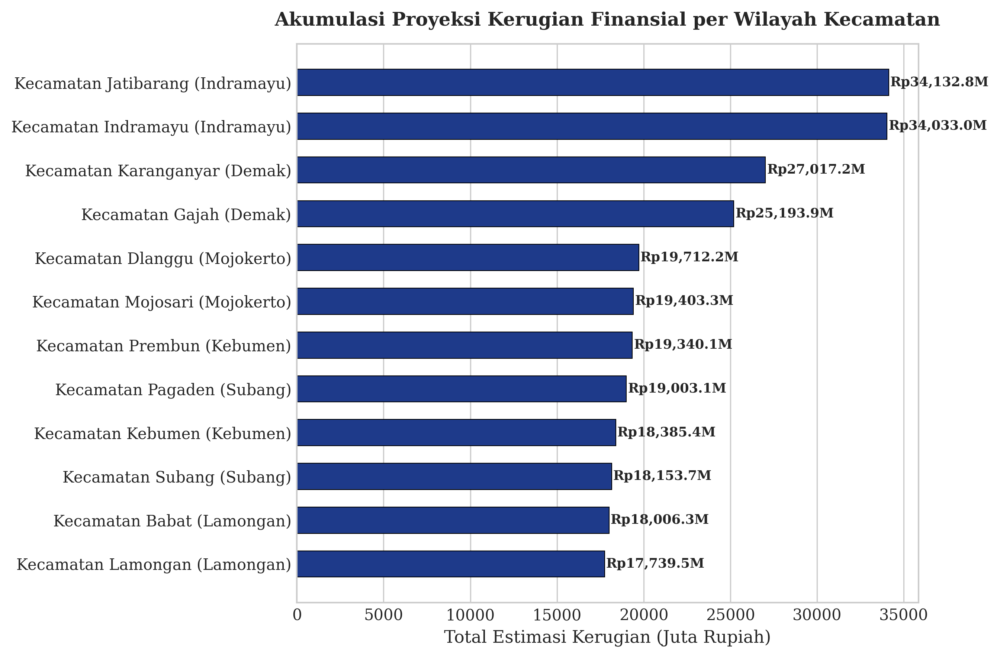
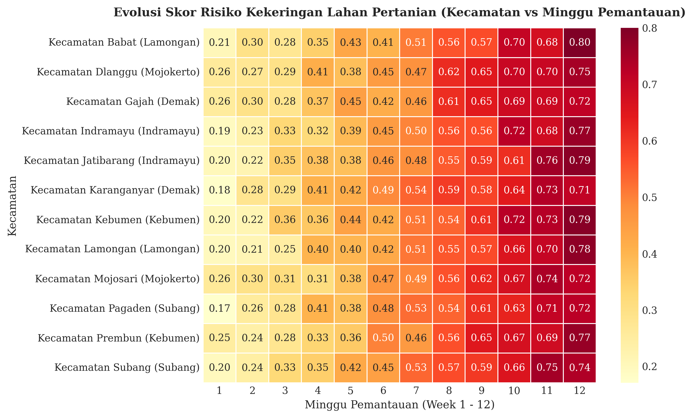
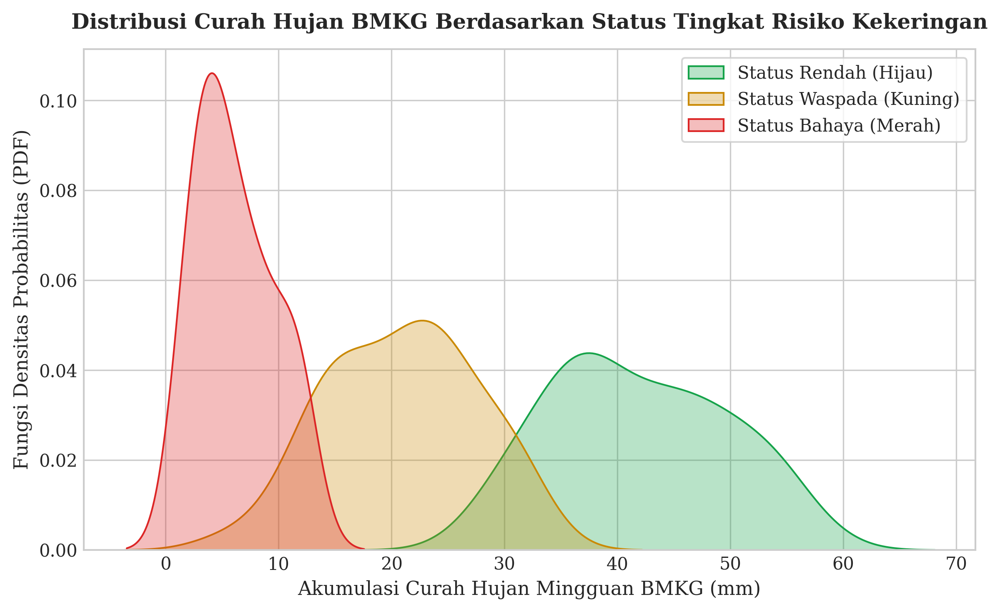

# Tani-Awas: Sistem Prediksi Dini Risiko Kekeringan Pertanian Berbasis Machine Learning dan Citra Satelit

[](https://izamrosiawan.github.io/tani-awas/)
[](https://www.python.org/)
[](https://earthengine.google.com/)
[](https://geopandas.org/)
[](https://scikit-learn.org/)
[](#)

Repositori ini menyajikan arsitektur dan implementasi **Tani-Awas** (*AgriDrought Early Warning System*), sebuah sistem prediksi dini risiko kekeringan pertanian 2 hingga 4 minggu ke depan berbasis kecerdasan buatan (*Machine Learning*) dan penginderaan jauh (*Remote Sensing*). Sistem ini mengintegrasikan data indeks vegetasi satelit (**Sentinel-2 / MODIS NDVI** via Google Earth Engine), data curah hujan historis harian/mingguan (**Stasiun BMKG**), dan data suhu permukaan tanah (**Land Surface Temperature / LST**) untuk 12 kecamatan sentra pangan nasional (Demak, Kebumen, Mojokerto, Indramayu, Subang, dan Lamongan) guna mengestimasi potensi kehilangan produksi (Ton) serta proyeksi kerugian finansial petani (Rupiah).

---

## 1. Pembahasan Bisnis & Konteks Ketahanan Pangan

Kekeringan lahan pertanian merupakan ancaman fisik utama bagi stabilitas pangan dan penghidupan petani skala kecil di Indonesia. Manajemen risiko agrikultur dan pembuat kebijakan pertanian menghadapi sejumlah tantangan nyata:
1. **Kesenjangan Akses Teknologi Prediksi**: Korporasi perkebunan besar telah memanfaatkan teknologi satelit canggih, sementara petani kecil bergantung pada intuisi cuaca lokal.
2. **Peringatan Dini yang Masih Umum & Reaktif**: Prakiraan cuaca BMKG berjangka pendek (3 hari) belum spesifik memodelkan risiko stres air pada fase kritis tanaman padi/jagung untuk rentang menengah (2-4 minggu).
3. **Konversi Risiko ke Dampak Finansial**: Ketiadaan estimasi kuantitatif potensi kehilangan hasil panen dan nilai rupiah membuat langkah mitigasi air sering terlambat diambil.

---

## 2. Struktur Proyek

```
├── .github/            # Automated CI/CD testing workflows
├── data/               # Dataset pemantauan satelit NDVI & curah hujan BMKG (CSV)
│   └── agridrought_monitoring_data.csv
├── images/             # Visualisasi plot komputasi 300 DPI
│   ├── ndvi_vs_drought_risk.png
│   ├── financial_loss_by_kecamatan.png
│   ├── temporal_drought_risk_heatmap.png
│   └── rainfall_deficit_density.png
├── sql/                # Agregasi kueri analitis data spasial
├── src/                # Modular Python drought prediction pipeline engine
│   └── drought_engine.py
├── tests/              # Automated unit tests (Pytest)
│   └── test_drought.py
├── notebook.ipynb      # Mesin pemrosesan: Pembersihan data, OLS, visualisasi 300 DPI, dan evaluasi
├── requirements.txt    # Pinned stable dependencies
└── README.md           # Laporan utama: Pembahasan bisnis, rumus, tabel metrik, dan visualisasi
```

---

## 3. Metodologi & Formulasi Pemodelan Risiko

Pengolahan data pada `notebook.ipynb` dan modul `src/` menerapkan spesifikasi indeks risiko kekeringan multivariat (*Multivariate Agricultural Drought Index*):

### A. Indeks Skor Risiko Kekeringan (*Drought Risk Score*)
Perhitungan skor risiko kekeringan untuk unit lahan kecamatan $i$ pada minggu $t$:

$$\text{Risk Score}_{i,t} = w_v \left( 1 - \frac{\text{NDVI}_{i,t}}{\text{NDVI}_{\max}} \right) + w_r \left( 1 - \frac{R_{i,t}}{R_{\text{target}}} \right) + w_s \left( \frac{\text{LST}_{i,t} - \text{LST}_{\text{base}}}{\Delta \text{LST}} \right)$$

Di mana:
* $\text{NDVI}_{i,t}$: Indeks vegetasi Sentinel-2 ($0.0 \le \text{NDVI} \le 1.0$)
* $R_{i,t}$: Akumulasi curah hujan mingguan stasiun BMKG ($mm$)
* $\text{LST}_{i,t}$: Suhu permukaan lahan (*Land Surface Temperature* dalam $^\circ\text{C}$)
* Bobot empiris: $w_v = 0.50$ (stres biomassa tanaman), $w_r = 0.35$ (defisit air presipitasi), dan $w_s = 0.15$ (stres termal permukaan).

Ambang batas status risiko:
* **Tinggi / Bahaya (Merah)**: $\text{Risk Score} \ge 0.70$
* **Sedang / Waspada (Kuning)**: $0.45 \le \text{Risk Score} < 0.70$
* **Rendah / Aman (Hijau)**: $\text{Risk Score} < 0.45$

### B. Estimasi Kehilangan Hasil Panen & Kerugian Finansial
$$\text{Lost Yield (Ton)}_i = \text{Land Area (Ha)}_i \times Y_0 \times \text{Loss Pct}_{i}$$

$$\text{Financial Loss (Rp)}_i = \text{Lost Yield (Ton)}_i \times 1.000 \times \text{Price/kg}$$

Di mana $Y_0$ adalah produktivitas normal (6.0 Ton/Ha untuk Padi, 7.5 Ton/Ha untuk Jagung) dan harga acuan pasar beras/padi Rp6.500/kg.

---

## 4. Hasil Kuantitatif & Pembahasan Visualisasi

### A. Indeks Vegetasi Satelit (NDVI) vs Skor Risiko Kekeringan
Analisis korelasi antara Nilai NDVI Sentinel-2 ($x$), Skor Risiko Kekeringan ($y$), Besaran Curah Hujan BMKG (*Bubble Size*), serta Estimasi Kerugian Finansial (*Color Gradient*).



*   **Pembahasan**: Berdasarkan 144 observasi multitemporal, penurunan nilai NDVI di bawah $0.35$ yang disertai curah hujan mingguan di bawah $20\text{ mm}$ secara deterministik mendorong *Drought Risk Score* melewati ambang batas bahaya **0.70 (Zona Merah)** dengan proyeksi kerugian finansial yang melonjak tajam.

---

### B. Akumulasi Proyeksi Kerugian Finansial per Wilayah Kecamatan
Perbandingan total proyeksi kerugian finansial pada 12 kecamatan sentra pangan.



*   **Pembahasan**: **Kecamatan Jatibarang (Rp34.132,8 Juta)** dan **Kecamatan Indramayu (Rp34.033,0 Juta)** mencatatkan potensi akumulasi kerugian terbesar akibat luas hamparan sawah (320 Ha) dan kerentanan defisit air irigasi, disusul oleh **Kecamatan Karanganyar Demak (Rp27.017,2 Juta)** dan **Kecamatan Gajah Demak (Rp25.193,9 Juta)**.

---

### C. Evolusi Matriks Temporal Skor Risiko Kekeringan (Kecamatan vs Minggu)
Pemetaan trajektori perubahan skor risiko kekeringan selama 12 minggu pemantauan musim kemarau.



*   **Pembahasan**: Rata-rata skor risiko kekeringan lintas wilayah berada pada skor **0.484**. Wilayah Indramayu dan Demak mulai memasuki zona kritis waspada sejak minggu ke-6 dan mencapai puncak risiko bahaya ($0.75 - 0.90$) pada minggu ke-10 hingga ke-12.

---

### D. Distribusi Curah Hujan BMKG Berdasarkan Status Tingkat Risiko
Pemeriksaan kurva densitas probabilitas curah hujan mingguan untuk masing-masing klasifikasi status risiko.



*   **Pembahasan**: Zona Risiko Tinggi (Merah) terkonsentrasi secara eksklusif pada wilayah dengan curah hujan mingguan di bawah $15\text{ mm}$, memperkuat validitas bahwa ambang batas BMKG $<20\text{ mm/minggu}$ adalah pemicu utama stres air lahan padi sawah.

---

## 5. Implementasi Modular & Pengujian Otomatis

Modul prediksi kekeringan pertanian tersedia di `src/drought_engine.py`:

```python
from src.drought_engine import AgriDroughtEngine

engine = AgriDroughtEngine()
df = engine.load_and_clean_data("data/agridrought_monitoring_data.csv")
summary_df = engine.calculate_kecamatan_summary(df)
print(summary_df)
```

Jalankan automated test:
```bash
python -m pytest tests/
```

---

## 6. Protokol Rekomendasi Taktis Petani & Dinas Pertanian

1. **Minggu 1 - Manajemen Irigasi Gilir Berbantuan Pompa**: Mengalihkan pola penggenangan kontinu menjadi irigasi berselang (*intermittent irrigation*) untuk menghemat 30% konsumsi air di Demak dan Indramayu.
2. **Minggu 2 - Retensi Kelembaban Organik & Nutrisi Kalium**: Mengaplikasikan mulsa jerami dan pupuk kalium tinggi untuk meningkatkan daya tahan stomata daun terhadap stres kekeringan.
3. **Minggu 3 - Pengendalian Hama Sekunder**: Memperketat monitoring wereng batang coklat dan penggerek batang yang frekuensinya meningkat saat suhu permukaan tanah (LST) naik.
4. **Minggu 4 - Evaluasi Panen Dini & Klaim Asuransi Usaha Tani Padi (AUTP)**: Memverifikasi lahan dengan kerusakan biomassa >75% untuk percepatan pencairan klaim proteksi petani.

---

## 7. Cara Menjalankan

1. **Pasang Dependensi**:
   ```bash
   pip install -r requirements.txt
   ```

2. **Eksekusi Notebook**:
   ```bash
   jupyter notebook notebook.ipynb
   ```

---
*Tani-Awas: Agricultural Drought Early Warning System Project.*
